# Real-Time E-Commerce Data Pipeline

A robust, event-driven data engineering pipeline designed to ingest, process, and visualize e-commerce transactions in real-time. This project demonstrates the integration of a distributed messaging system (Kafka), a stream processing engine (Spark), and a search/analytics engine (Elasticsearch).

## 🏗️ Architecture
The pipeline follows a modern "Hot Path" streaming architecture:
1.  **Data Source**: Python simulator reading from `orders.csv` to mimic live user activity.
2.  **Ingestion Layer**: **Apache Kafka** acting as the resilient message broker.
3.  **Stream Processing**: **Spark Structured Streaming (Scala)** performing real-time data validation and filtering (handling missing values/NaNs).
4.  **Storage & Indexing**: **Elasticsearch** for high-performance data retrieval and full-text search.
5.  **Visualization**: **Kibana** for live dashboarding and KPI monitoring.
### 📊 Project Data Flow

```mermaid
graph LR
    %% Data Source & Ingestion
    subgraph Ingestion
    orders_csv[(orders.csv)] -.->|Raw Data| producer_py[producer.py]
    producer_py -->|1. Produce JSON events| kafka_topic[Kafka Topic: user_orders]
    end

    %% Stream Processing
    subgraph Streaming
    kafka_topic -->|2. Structured Stream| spark_consumer[Spark Structured Streaming]
    spark_consumer -->|3. Filter NaN & Validate| clean_stream[Clean Stream in Memory]
    end

    %% Storage & Analytics
    subgraph "ELK Stack"
    clean_stream -->|4. Index Documents| elasticsearch[(Elasticsearch)]
    elasticsearch <-->|5. Real-Time Analytics| kibana[Kibana Dashboard]
    end

    %% Styling for clarity
    style orders_csv fill:#f9f,stroke:#333,stroke-width:2px;
    style kafka_topic fill:#ccf,stroke:#333,stroke-width:2px;
    style spark_consumer fill:#ff9,stroke:#333,stroke-width:2px;
    style elasticsearch fill:#dfd,stroke:#333,stroke-width:2px;
    style kibana fill:#dff,stroke:#333,stroke-width:2px;
```

## 🛠️ Tech Stack
* **Languages**: Scala 2.12, Python 3.10
* **Stream Processing**: Apache Spark 3.2.4
* **Messaging**: Confluent Kafka 7.4.0
* **Database**: Elasticsearch 8.10.2
* **Visualization**: Kibana 8.10.2
* **Containerization**: Docker & Docker Compose

## 🚀 How to Run

### 1. Start the Infrastructure
Launch the Kafka and ELK stack using Docker:
\`\`\`bash
docker compose up -d
\`\`\`

### 2. Start the Spark Consumer
Compile and run the Scala streaming application to begin listening to Kafka:
\`\`\`bash
sbt "runMain pipeline.StreamingConsumer"
\`\`\`

### 3. Run the Data Producer
Start the Python script to stream records into the pipeline:
\`\`\`bash
python3 data/producer.py
\`\`\`

### 4. Monitor & Visualize
* **Elasticsearch**: Verify data ingestion at \`http://localhost:9200/spark_ecommerce_orders/_count\`
* **Kibana**: Open \`http://localhost:5601\` to view live dashboards. Create a Data View for \`spark_ecommerce_orders*\`.

## 🛡️ Resilience & Features
* **Data Sanitization**: The Spark engine includes a pre-storage filter to drop malformed or \`NaN\` records, ensuring the pipeline remains "Up" even with messy data.
* **Decoupled Design**: Kafka ensures that if the Spark consumer is restarted, no data is lost; it simply picks up where it left off using checkpointing.

